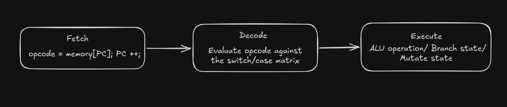

# Aethel-8 Architectural Whitepaper
This document provides a rigorous, low-level architectural analysis of the structural design, data pipelines, hardware-software abstraction boundaries, and internal execution mechanics of the Aethel-8 computer system.

---

## 1. The Von Neumann Execution Pipeline

Aethel-8 relies strictly on a single-bus Von Neumann configuration where operational instructions (code) and mutable runtime state (data) share a unified, flat 256-byte vector array. 

The control unit utilizes a synchronous, cycle-accurate **Fetch-Decode-Execute** pipeline to mutate the state of the machine.

### Architectural Breakdown of the Cycle:

1. **Fetch Stage:** The Control Unit accesses the 256-byte `memory` array using the unsigned index held by the Program Counter (`cpu->PC`). The target byte is loaded as the current instruction opcode, and the `PC` immediately increments by 1 to maintain forward pointer progression.
2. **Decode Stage:** The retrieved opcode is injected into a hardware switch-case decoding block. If the instruction maps to a multi-byte format requiring downstream data operands (such as an immediate numerical scalar or an absolute memory target address), the Control Unit accesses the location currently targeted by the updated `PC`, reads the argument byte, and increments the `PC` a second time.
3. **Execute Stage:** The decoded instruction activates internal execution pathways. Arithmetic and logic commands route data lines from the scalar storage registers (`A` and `B`) directly through the Arithmetic Logic Unit (ALU).

---

## 2. Arithmetic Logic Unit (ALU) & Hardware Flags

The Aethel-8 ALU operates natively using unsigned 8-bit wrap-around modulo arithmetic. Because the storage registers are bounded by fixed-width type constraints (`uint8_t`), mathematical boundary conditions behave exactly like physical copper traces under current saturation:

* **Hardware Underflow:** If Register A contains `0x00` and Register B contains `0x01`, executing a `SUB` command forces Register A to wrap around seamlessly to `0xFF` (Decimal 255).
* **Hardware Overflow:** If Register A contains `0xFF` and Register B contains `0x01`, executing an `ADD` command forces the register to wrap back to `0x00` (Decimal 0), discarding the bit-9 carry flag.

### The Zero Flag (ZF) Evaluation

The single-bit conditional flag status line (`cpu->ZF`) acts as the machine's primary logic gate for non-linear code execution. Every computational ALU operation (`ADD`, `SUB`, `MUL`) dynamically mutates this flag according to the following truth criteria:

$$\text{If } \text{Reg A} == 0 \implies \text{ZF} = 1$$

$$\text{If } \text{Reg A} \neq 0 \implies \text{ZF} = 0$$

This provides the machine with structural historical memory of the last calculated state, which downstream branching instructions leverage to execute logical choices.

---

## 3. Two-Pass Compiler Mechanics (The Mini-Assembler)

The integrated assembler functions as a deterministic string-to-binary translation compiler. To transform unformatted human text commands into absolute machine bytecode, it steps through a precise string tokenization pipeline:

1. **Isolation:** The compiler clones the incoming input text buffer into an isolated tracking variable to guarantee immutable string parsing.
2. **Mnemonic Parsing:** The string is segmented using a standard space delimiter (`" "`). The first isolated substring token is matched against defined hardware instruction mnemonics using string comparisons (`strcmp`).
3. **Operand Resolution:** If a multi-byte opcode match is found (e.g., `LDA`), the tokenizer advances to extract the secondary argument string. This text token undergoes runtime integer conversion (`atoi`), boundary validation to ensure it falls within legal 8-bit limits ($0 \le \text{value} \le 255$), and serialization directly into the memory grid.
4. **Memory Layout Compacting:** The assembler returns the exact number of bytes written to memory (`1` or `2`). The operating system REPL uses this return value to advance its internal `current_address` pointer, cleanly packing instructions sequentially side-by-side without leaving dead memory gaps.

---

## 4. Systems Analysis of an Operational Memory Collision

During structural system evaluation, a notable phenomenon occurred when the instruction sequence `STA 7` was processed immediately prior to an execution cycle.

Because code instructions and application data share the exact same physical space inside a Von Neumann architecture, executing `STA 7` forced the value of Register A directly into memory cell `0x07`. This action physically modified the upcoming raw bytes waiting to be read by the processing loop.

When the Program Counter (`PC`) advanced into that updated sector, it fetched the newly modified data byte and attempted to decode it as a live operational instruction opcode. This resulted in the CPU executing a conditional `JNZ` command that had been synthesized dynamically during runtime.

This unexpected loop execution perfectly validates the execution precision of this virtual machine: it natively replicates the exact hardware-level memory collision realities (such as buffer overruns and self-modifying code architectures) that real-world computers navigate at scale.
